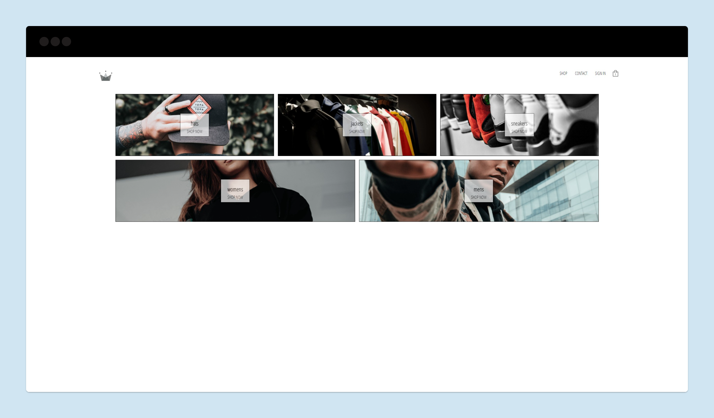
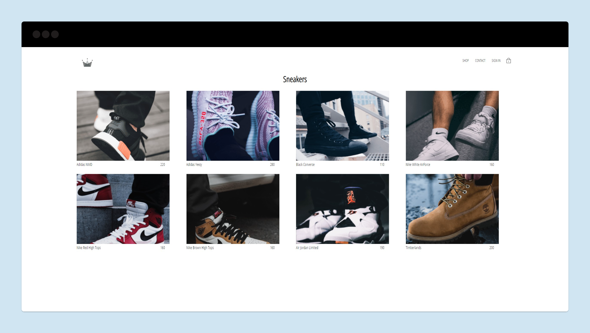

<div align="center">
    <h1>Crown Store</h1>
    <p>Full e-commerce site using Firebase as back-end and redux as state management.</p>
</div>




## Run it on your machine

1. Clone the project

   ```sh
   git clone https://github.com/aznamle/E-commerce-project.git
   ```

1. Install the dependencies

   ```sh
   cd E-commerce-project
   npm install
   ```

3. Start the development server

   ```sh
   npm start
   ```

<div align="center">
    <p>
        Built with <a href="https://www.reactjs.org/" target="_blank">React.js</a> and hosted with <a href="https://www.vercel.com/" target="_blank">Vercel</a>
    </p>
</div>